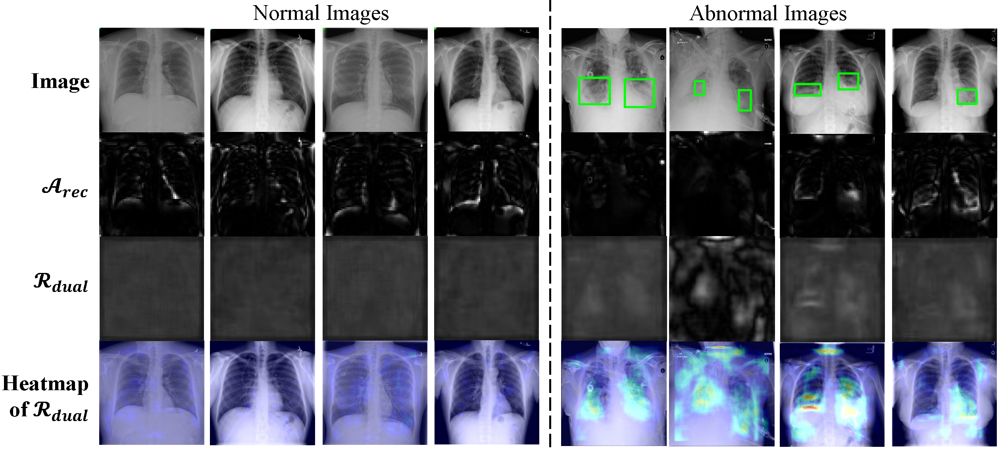
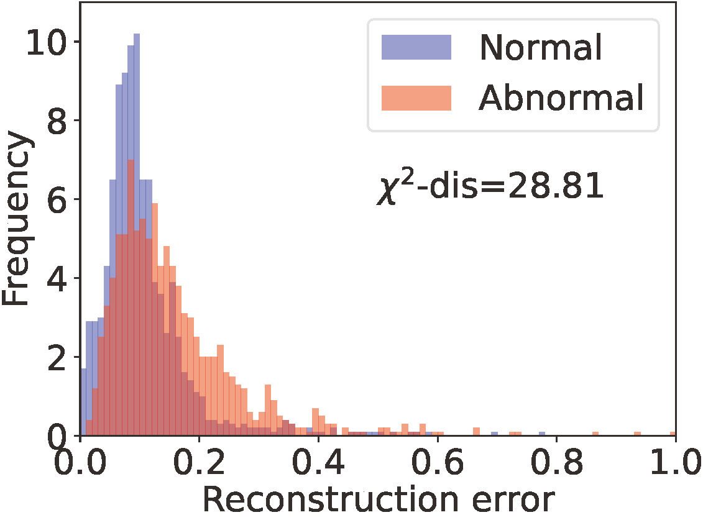
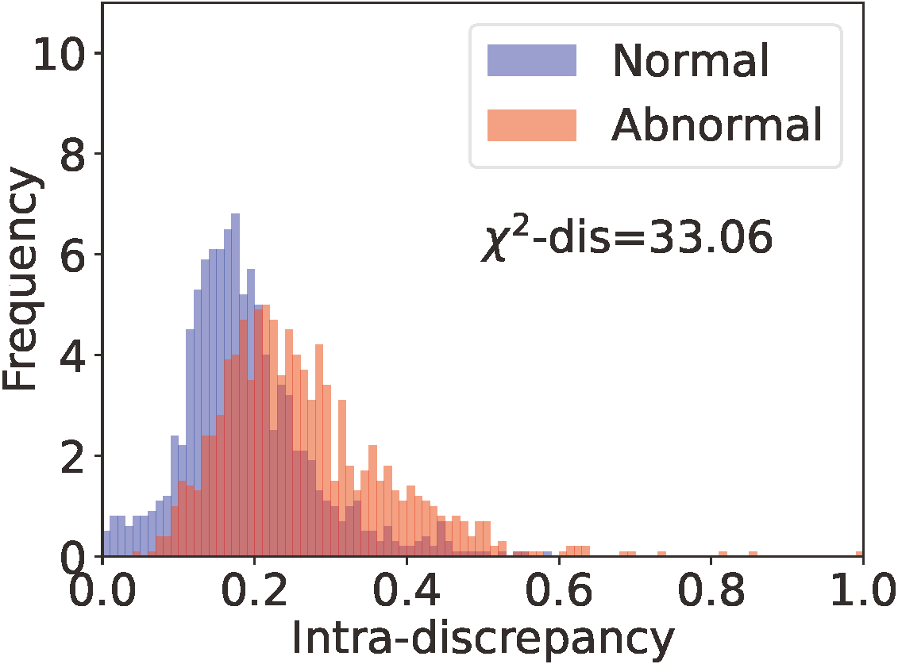
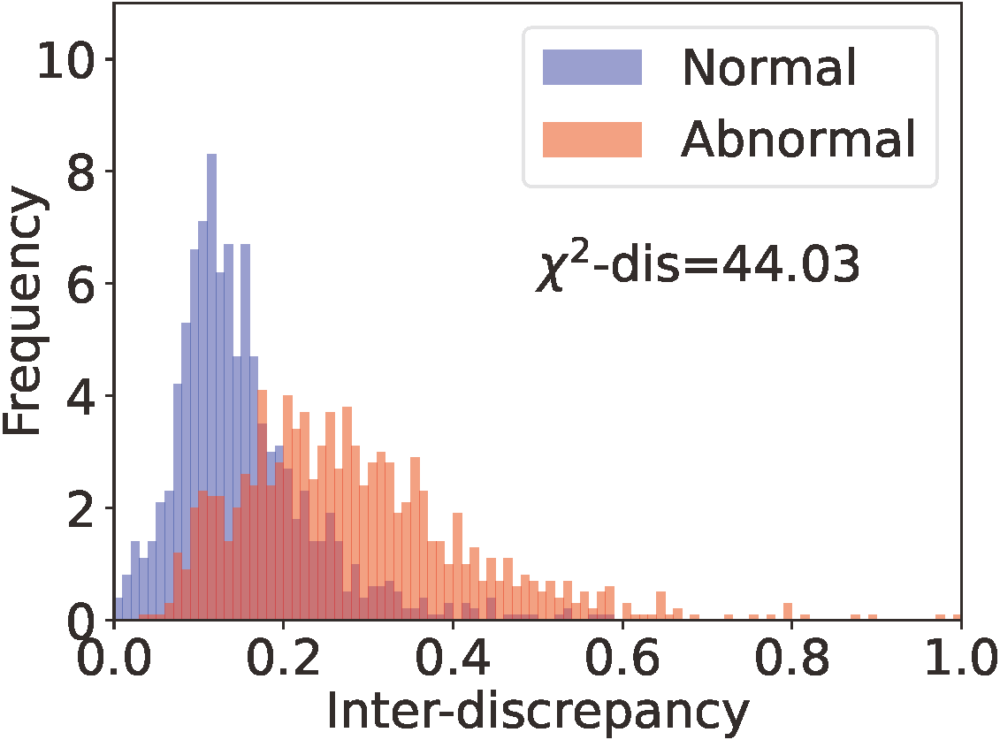
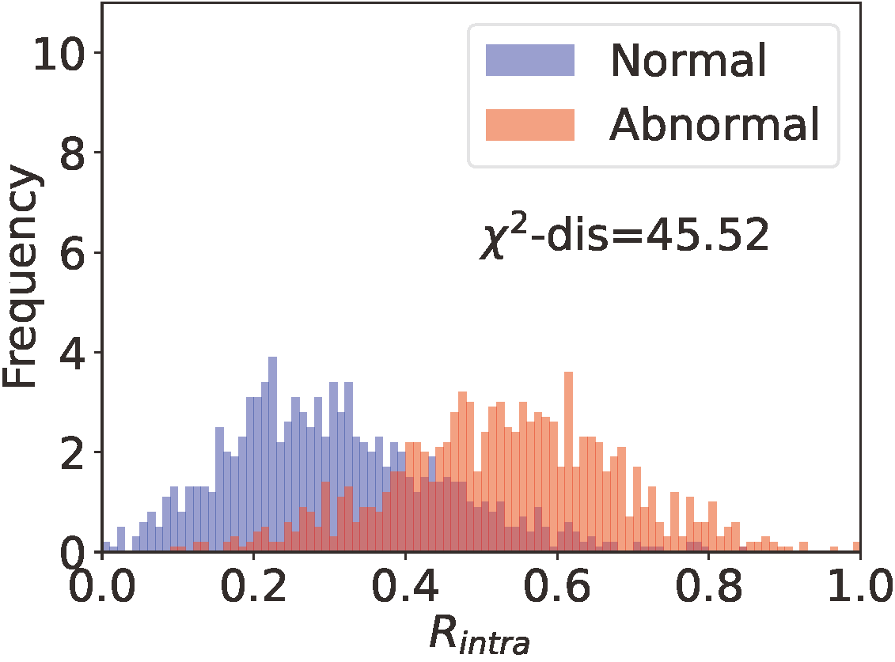
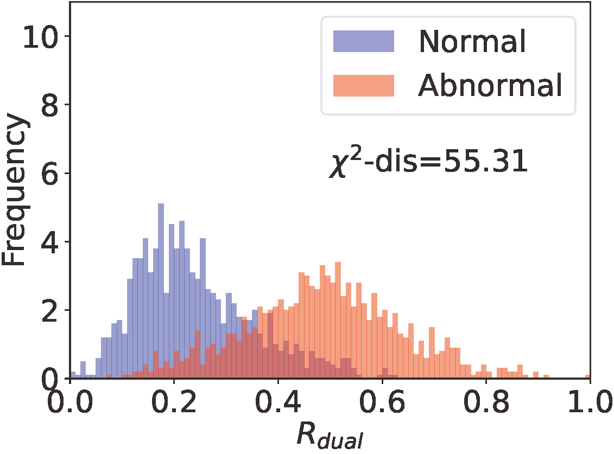

<p align="center">
  <h1 align="center">Dual-distribution discrepancy with self-supervised refinement for anomaly detection in medical images</h1>
  <p align="center">
    Yu Cai, Hao Chen, Xin Yang, Yu Zhou, Kwang-Ting Cheng
  </p>
  <h3 align="center"><a href="https://arxiv.org/abs/2210.04227">Paper</a>
  <div align="center"></div>
</p>

## Visualization on Med-AD

<p align="center"></p>

From top to bottom: original image, , DDAD-, DDAD-, DDAD-.


## Data Preparation

### Option 1

Download the well-processed Med-AD benchmark from: [Google Drive](https://drive.google.com/file/d/1ijdaVBNdkYP4h0ClYFYTq9fN1eHoOSa6/view?usp=sharing) | [OneDrive](https://hkustconnect-my.sharepoint.com/:u:/g/personal/ycaibt_connect_ust_hk/EdCbKrjjRMlKi-1AotcAfkoB_jmbTQ2gnQChltgh7l8xVQ?e=t17t2S). <br>
(The benchmark is organized using 4 public datasets, and should be **only applied for academic research**.)


### Option 2

Organize the Med-AD benchmarks manually follow the [guidance](https://github.com/caiyu6666/DDAD-ASR/tree/main/data).


## Environment

- NVIDIA GeForce RTX 3090
- Python 3.10
- Pytorch 1.12.1

### Packages

```
conda install pytorch torchvision torchaudio cudatoolkit=11.3 -c pytorch -c nvidia
pip install pillow
pip install joblib
pip install pydicom
pip install opencv-python
pip install scikit-learn
pip install tensorboard
pip install matplotlib 
pip install tqdm
```


## Train and Evaluate

All scripts are available in `scripts/`, and configuration files are in `cfgs/`.
Train and evaluate the method on RSNA dataset using AE as the backbone: `./scripts/run_rsna_ae.sh`

```python
python main.py --config cfgs/RSNA_AE.yaml --mode a;
python main.py --config cfgs/RSNA_AE.yaml --mode a;
python main.py --config cfgs/RSNA_AE.yaml --mode a;  # ensemble 3 networks for module a (UDM)
python main.py --config cfgs/RSNA_AE.yaml --mode b;
python main.py --config cfgs/RSNA_AE.yaml --mode b;
python main.py --config cfgs/RSNA_AE.yaml --mode b;  # ensemble 3 networks for module b (NDM)
python main.py --config cfgs/RSNA_AE.yaml --mode eval;
python main.py --config cfgs/RSNA_AE.yaml --mode r;
python main.py --config cfgs/RSNA_AE.yaml --mode eval_r;
```

Similarly, for training/evaluating on other datasets using other backbones, the following commands can be used:

```
./scripts/run_rsna_ae.sh
./scripts/run_rsna_memae.sh
./scripts/run_rsna_aeu.sh

./scripts/run_vin_ae.sh
./scripts/run_vin_memae.sh
./scripts/run_vin_aeu.sh

./scripts/run_brain_ae.sh
...

./scripts/run_lag_ae.sh
...
```


The trained models and results are available [here](https://github.com/caiyu6666/DDAD-ASR/releases/tag/downloads).


## Qualitative Analysis

### AS histograms

 


## Contact

If any questions, feel free to contact: [yu.cai@connect.ust.hk](mailto:yu.cai@connect.ust.hk)


## Acknowledgement

We really appreciate these wonderful open-source codes and datasets!

### Codes

1. https://github.com/dbbbbm/UAE
2. https://github.com/donggong1/memae-anomaly-detection

### Datasets

1. [RSNA Pneumonia Detection Challenge dataset](https://www.kaggle.com/c/rsna-pneumonia-detection-challenge)
2. [Vin-BigData Chest X-ray Abnormalities Detection dataset (VinDr-CXR)](https://www.kaggle.com/c/vinbigdata-chest-xray-abnormalities-detection)
3. [Brain Tumor MRI dataset](https://www.kaggle.com/datasets/masoudnickparvar/brain-tumor-mri-dataset)
4. [Large-scale Attention-based Glaucoma (LAG) dataset](https://github.com/smilell/AG-CNN)


## Citation

If this work is helpful for you, please cite our papers:

```
@article{cai2022dualdistribution,
  title={Dual-distribution discrepancy with self-supervised refinement for anomaly detection in medical images},
  author={Cai, Yu and Chen, Hao and Yang, Xin and Zhou, Yu and Cheng, Kwang-Ting},
  journal={arXiv preprint arXiv:2210.04227},
  year={2022}
}

@inproceedings{cai2022dual,
  title={Dual-Distribution Discrepancy for Anomaly Detection in Chest X-Rays},
  author={Cai, Yu and Chen, Hao and Yang, Xin and Zhou, Yu and Cheng, Kwang-Ting},
  booktitle={International Conference on Medical Image Computing and Computer-Assisted Intervention},
  pages={584--593},
  year={2022},
  organization={Springer}
}
```

